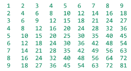

# turbo-umbrella
P04 de Entornos de desarrollo

# Estructuras de control.
## 1. IF. ⚡
Sirve para que un programa realice diferentes acciones dependiendo del valor que le des, funciona como una expresión booleana. Si es true, el programa realiza ciertas instrucciones; de lo contrario (false) realiza otras.

Tras el if siempre hay que colocar unas llaves “{ }”, y dentro de estas colocar lo que queremos hacer si ese if se cumple.

Se puede poner la condición de varias formas:

- If simple: si la expresión es verdadera se realiza lo que pongamos dentro, si no simplemente lo salta y pasa a la siguiente acción que tenga que hacer.
- If – else: la acción simple se puede ampliar con un else. Esto ejecuta el caso contrario de la condición que tengamos en el if, pero nunca se pueden ejecutar ambos.
- If – else if - else: Si la acción tiene varias condiciones podemos ampliarla con varios else if como necesitemos. Cuando tenemos una estructura con varios caminos se le llama arbol de decisión, en la que la última rama (el else) significa en todos los demás casos...               Cuando se habla de condiciones, los programadores suelen utilizar el término "declaraciones de flujo de control". El flujo de control es el orden en el que se ejecutan varias partes de un programa.

_**Operador temario**_

También llamado el operador condicional, evalúa una condición y elige uno de dos casos para ejecutar. Puede considerarse como una forma de instrucción if – entonces – else. A veces es más legible y conciso que la correspondiente instrucción if.

La forma básica de este operador es:
``` java
int max = a > b ? a : b;
```
significando cada cosa:

resultado = condición ? casoVerdadero : casoFalso;

Por ejemplo, si nos piden cuál es el número máximo de dos variables int a y b:
``` java
int num = ...; // inicializamos la variable con un valor numérico
System.out.println(num % 2 == 0 ? "Par" : "Impar");
```
En este ejemplo tenemos tres operadores:
-	La condición: que en nuestro caso sería num % 2 == 0, sería la condición que dice si el valor que introducimos es verdadero o false. Si es verdadero es par, y si es falso es impar.
-	El caso Verdadero: que sería par.
-	El caso falso: que sería impar.

El tipo de resultado es de texto osea es de tipo String, en el ejemplo está metido dentro de un sout, pero se podría guardar el resultado en una variable de tipo String.
## 2. SWITCH ⚡
Es similar al if, pero simplifica el trabajo cuando tienes muchas ramas.
La instrucción switch te deja elegir el tipo de acción entre varios casos según el valor de una sola variable, esta puede ser un número entero, un carácter, una cadena de texto o un tipo enumerado. 

Esta instrucción se puede utilizar de tres formas:
-	Utilizando case, break y default
``` java
switch (variable) {
    case 1:
        System.out.println("instrucciones");
        break; //siempre se pone un break para que una vez realizada esta acción el programa termine
    case 2:
        System.out.println("instrucciones");
        break;
    case 3:
        System.out.println("instrucciones");
        break;
    case 4:
        System.out.println("instrucciones");
        break;
    default: // Si no se ha elegido ninguna de las acciones anteriores el default significa como un “en los demás casos”. Se ejecutará la instrucción que pongamos aquí.
        System.out.println("instrucciones");
    }
}
```
- Utilizando case, yield y default. switch puede tratarse como una expresión que devuelve un valor como si fuera la instrucción return. Para ello utilizamos la palabra clave yield. Como para llegar a ver la instrucción return nos queda un rato, de momento solamente lo ponemos aquí para que sepas que esto se puede hacer.
``` java
String día = "Lunes";
int contador = switch (día) {
    case "Lunes":
        yield 1;
    case "Martes":
        yield 2;
    case "Miércoles":
        yield 3;
    case "Jueves":
        yield 4;
    case "Viernes":
        yield 5;
    default:
        yield -1;
};
System.out.println(contador); 
```

- Utilizando: case, ->, y default. Se pueden omitir los break si dentro del switch empleamos una flecha en lugar de los “ : ”.
``` java
String día = "Lunes";
int contador;
switch (día) {
    case "Lunes" -> contador = 1;
    case "Martes"-> contador = 2;
    case "Miércoles" -> contador = 3;
    case "Jueves" -> contador = 4;
    case "Viernes" -> contador = 5;
    default -> contador = -1;
};
System.out.println(contador); // imprime 1
```

## **Estructuras repetitivas:**

A veces necesitamos repetir un código varias veces, y en java hay dos formas de simplificar esto:
-	Si se conoce el número de repeticiones, se puede utilizar el bucle FOR.
-	Si no se sabe cuántas veces hay hacer las repeticiones se utiliza el bucle while.
## 3. FOR ⚡
La forma básica es:
``` java
for (inicialización; condición; modificación){
    // Instrucciones que hay que repetir un número determinado de veces.
}
```
- Inicialización: se ejecuta una vez antes de que comience el ciclo.

- Condición: es una expresión booleana que determina si se va a hacer la siguiente iteración, si es false, el bucle termina; en caso contrario, el bucle continúa en la siguiente iteración.

- Modificación: es una instrucción (normalmente incremento o decremento) que cambia el valor de la variable del bucle se invoca después de cada iteración.

La instrucción de inicialización, la condición y la modificación son opcionales, es posible
que el bucle for no las tenga todas. Un ejemplo extremo de esto podría ser el siguiente:
``` java
int n = 9;
int i = 0; // sacamos la inicialización fuera del bucle; funciona igual
for (; ;) {
    if (i <= n) { // sacamos la condición fuera del bucle; funciona igual
        System.out.print(i + " ");
        i++; // metemos la modificación dentro del bloque; funciona igual
    }
}
```

Los bucles for pueden ser anidados.
Como por ejemplo, el siguiente código imprime la tabla de multiplicar los números del 1 al 9.
``` java
for (int i = 1; i < 10; i++) {
    for (int j = 1; j < 10; j++) {
        System.out.print(i * j + "\t");
    }
        System.out.println();
}

Imprime:
```

## 4. WHILE Y DO WHILE. ⚡
### While
El bucle while consta de un bloque de código y una condición. 

La forma básica es:
``` java
while (condición) {
// cuerpo: instrucciones que hacen algo repetidamente
}
```
Si la condición es true, se ejecuta el código dentro del bloque. Este código se repite hasta que la condición se vuelve false.

Dado que se verifica la condición antes de que se ejecute el bloque, esta estructura de control también se conoce como bucle pre-test. Se puede pensar en el bucle while como en una instrucción condicional repetitiva. El cuerpo del bucle puede contener cualquier instrucción o grupo de instrucciones, incluidas instrucciones condicionales (if) u otros bucles.

### Do while.

En el bucle do-while, el cuerpo se ejecuta primero, mientras que la condición se prueba
después. Si la condición es true, las instrucciones dentro del bloque se ejecutan
nuevamente. Esto se repite hasta que la condición se vuelve false.

La forma básica es:
``` java
do {
    // cuerpo con instrucciones que se repiten al menos una vez
} while (condición);
```
Este bucle es post-test: en el bucle do-while el código dentro del bloque siempre se ejecuta al
menos una vez.


### Ejercicios para practicar
Ejercicios para prácticar: [ejercicios](https://drive.google.com/file/d/1P4VaWNgxXSEmzS26OqRTq0FLjyOP78Ef/view) 

